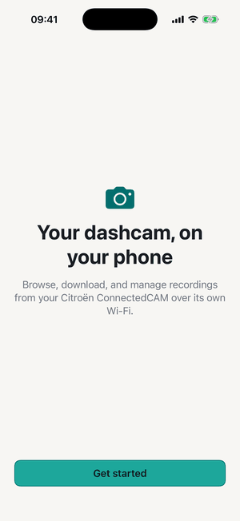
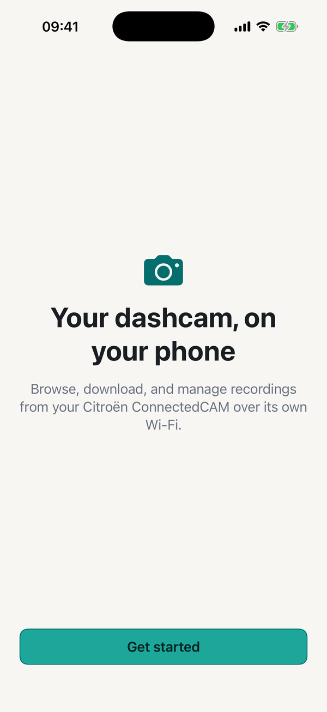
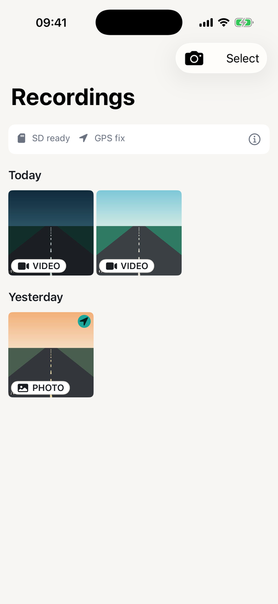
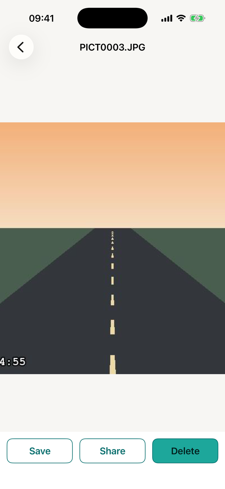
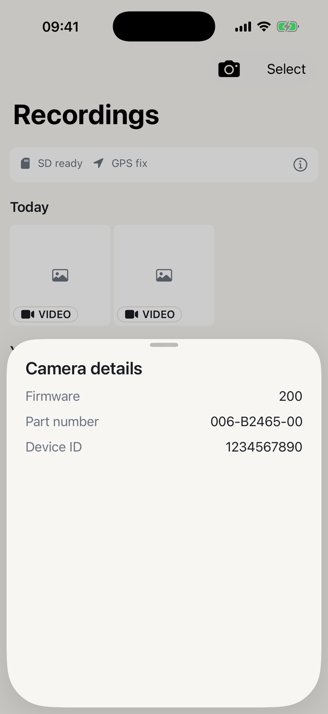
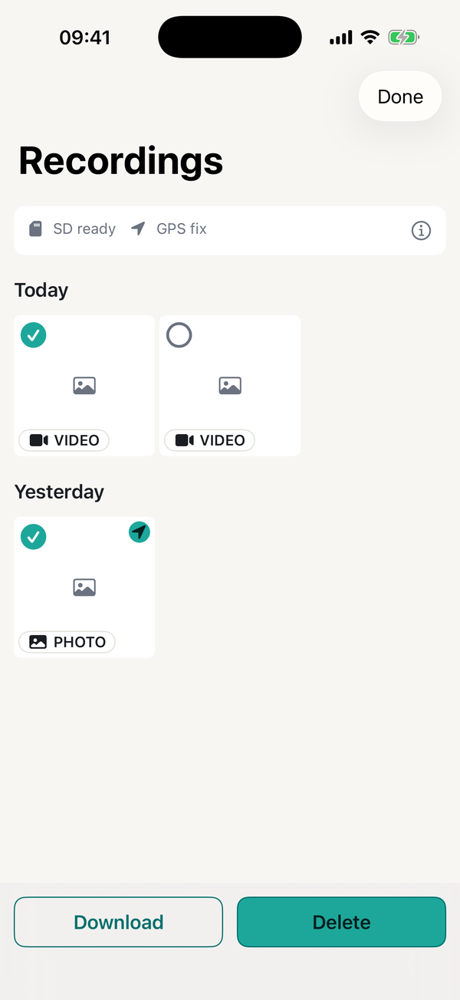

# Citroën Connected Camera (iOS)

[](https://github.com/hihelloluigi/citroen-connected-camera-ios/actions/workflows/ci.yml)
[](LICENSE)
[](#requirements)
[](https://swift.org)

Browse, download, and manage the recordings on your Citroën ConnectedCAM dashcam — over the
camera's own Wi-Fi, straight from your iPhone. A guided setup hands off to a date-sectioned
gallery with multi-select download and delete, a snapshot action, and a detail screen with photo
zoom, video playback, save-to-Photos and share. Available in English, Italian, Spanish and French.

> [!IMPORTANT]
> **This is an unofficial, independent project.** It is not affiliated with, authorized by,
> endorsed by, or connected to Citroën, Stellantis, PSA, or Garmin in any way. "Citroën" and
> "ConnectedCAM" are trademarks of their respective owners.
>
> It talks to your camera's local API, which means it **can change camera settings and permanently
> delete recordings**. Nothing is recoverable from the app once deleted. Use at your own risk.

<p align="center">
  
</p>

## Screenshots

<table>
  <tr>
    <td align="center"><br><sub>Guided setup</sub></td>
    <td align="center"><br><sub>Recordings by date</sub></td>
    <td align="center"><br><sub>Save, share, delete</sub></td>
    <td align="center"><br><sub>Camera details</sub></td>
    <td align="center"><br><sub>Bulk download &amp; delete</sub></td>
  </tr>
</table>

<sub>Captured in the Simulator against a scripted camera. The road frames are drawn placeholders
that ship with the demo build — on real hardware they are your own footage.</sub>

## Installation

**There is no App Store build.** This app is not distributed through the App Store, so you install
it by building it yourself and running it on your own iPhone. You need a Mac.

### 1. Install the prerequisites

- **Xcode 26.6** or newer, from the Mac App Store
- **[Mint](https://github.com/yonaskolb/Mint)**, which pins the build tools:

  ```sh
  brew install mint
  ```

### 2. Clone and bootstrap

```sh
git clone https://github.com/hihelloluigi/citroen-connected-camera-ios.git
cd citroen-connected-camera-ios
./scripts/bootstrap.sh
```

`bootstrap.sh` installs the pinned tools and generates `CitroenConnectedCamera.xcodeproj`. The
project file is **not** in the repository — it is generated from `project.yml`, so this step is not
optional.

### 3. Open it

```sh
open CitroenConnectedCamera.xcodeproj
```

It builds and runs in the Simulator right away, with no configuration and no camera.

### 4. Put it on your iPhone

To run it on a real device you need a signing team — a free Apple ID works.

1. Copy the environment template and fill in your team ID:

   ```sh
   cp envs/.env.example envs/.env.development
   ```

   Set `CCAM_TEAM_ID` to your 10-character Apple Developer Team ID (Xcode → Settings → Accounts,
   or the top of [developer.apple.com/account](https://developer.apple.com/account)).

2. Select the **Development** scheme, choose your iPhone, and hit Run.
3. On the iPhone, trust the certificate under **Settings → General → VPN & Device Management**.

> With a free Apple ID the build expires after 7 days and has to be re-installed. A paid Apple
> Developer account raises that to a year.

### 5. Connect to the camera

1. Start the car, so the camera powers up.
2. On the iPhone, join the Wi-Fi network named **`ConnectedCAM####`** (the digits vary per camera).
   The factory password is `ConnectedCam`.
3. Open the app and follow the setup flow. Allow **Local Network** access when iOS asks — without
   it the app cannot reach the camera at all.

Location access is optional. It is only used to show which Wi-Fi network you are on, so the app can
confirm you are connected to the camera; "Not now" is a first-class choice and everything else
still works.

More detail, including the three build configurations, is in [docs/running.md](docs/running.md).

## Supported hardware

This app was built against one camera, by reverse-engineering its local HTTP API from a packet
capture of the official app. The protocol notes are in [API_ANALYSIS.md](API_ANALYSIS.md).

| | |
|---|---|
| **Vehicle** | Citroën C3 (2016–2020) |
| **Camera** | ConnectedCAM — a rebadged Garmin VIRB |
| **Firmware** | `200` |
| **vimVersion** | `140` |
| **Part number** | `006-B2465-00` |
| **Wi-Fi SSID** | `ConnectedCAM####` |
| **Camera address** | `http://192.168.0.1` (cleartext HTTP, no TLS) |

Other cars and firmware revisions shipped the same camera and will very likely work, but they are
genuinely untested — nobody has run this against them yet. If the protocol differs on yours, the
app will fail at the connection step rather than misbehave.

## Does it work on yours?

**Compatibility reports are the most useful contribution right now** — more useful than code.
If you have a ConnectedCAM, [open an issue](https://github.com/hihelloluigi/citroen-connected-camera-ios/issues/new)
and say so, whether it worked or not. Please include:

- your car model and year
- the firmware and part number the app shows under **Camera details** (the ⓘ in the gallery
  header) — or what it showed before it failed
- what happened, and at which step

The same sheet shows a **Device ID**, which is your camera's serial number. Please leave it out —
nothing here needs it, and issues are public. The report form asks for the right fields.

Bug reports and feature requests are welcome in the same place.

## Support the project

If this saved your ConnectedCAM footage, **consider starring the repo** ⭐ — it costs nothing and
it is how other ConnectedCAM owners find this.

<a href="https://buymeacoffee.com/probablyadeveloper">
  
</a>

## Requirements

Xcode 26.6, iOS 17+, [Mint](https://github.com/yonaskolb/Mint). XcodeGen and SwiftLint are pinned in
`Mintfile` and installed by `bootstrap.sh`; there are no third-party runtime dependencies.

## Architecture

MVVM + Coordinator over SPM modules, tiered into `Packages/Core/` (8 modules) and
`Packages/Features/` (2), with a thin app shell. The layer boundaries are enforced by SwiftLint
rules, not just documented. 145 tests across eleven targets, including a UI suite that drives the
real app against a scripted camera.

## Documentation

- [Architecture](docs/ARCHITECTURE.md) — modules, navigation, the data boundary
- [Tests](docs/TESTS.md) — what is covered where, and how to run it
- [Localization](docs/LOCALIZATION.md) — the string catalog and the four locales
- [Secrets](docs/SECRETS.md) — the `.env` → `Secrets.xcconfig` pipeline
- [Running locally](docs/running.md) — setup, devices, build commands
- [Notes](docs/NOTES.md) — accepted tradeoffs and deferred work
- [Local API reference](API_ANALYSIS.md) — the reverse-engineered camera protocol
- [`CLAUDE.md`](CLAUDE.md) — the agent index

## Before a public release

Tracked in [docs/NOTES.md](docs/NOTES.md); the short version:

- **App Review cannot test this app** without a physical camera. A demo mode or review notes plus a
  video is the largest open item, and it is not a code problem.
- **Native review of the it/es/fr translations.**
- A support URL and a privacy-policy URL for App Store Connect, and a real marketing version.

## Security

Please report vulnerabilities privately — see [SECURITY.md](SECURITY.md).

## License

MIT — see [LICENSE](LICENSE).
